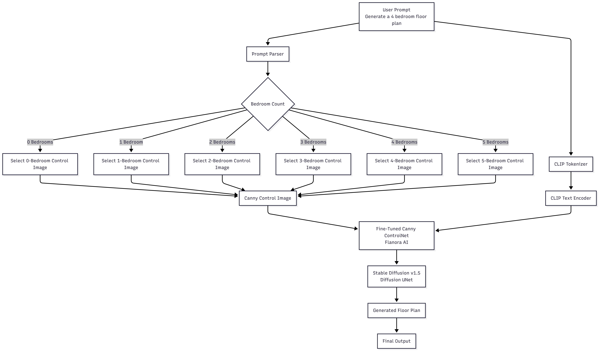

# Notebooks

This directory contains the Jupyter notebooks used during the development and training of **Flanora AI**.

## Training Notebook

The training notebook contains the complete workflow used to fine-tune the Canny ControlNet for floor-plan generation.

The notebook covers:

1. Dataset preprocessing
2. Canny edge extraction
3. Dataset loading and organization
4. Bedroom-count label handling
5. ControlNet initialization
6. Stable Diffusion v1.5 integration
7. Fine-tuning of the Canny ControlNet
8. Training configuration and logging
9. Model inference
10. Generation of floor-plan images

## Dataset

The model was trained using the curated:

**ROBIN-ImagesGT-Merged-Flanora-AI-v1**

dataset containing **622 floor-plan images** distributed across six bedroom-count categories:

| Category | Images |
|---|---:|
| 0 bedroom | 11 |
| 1 bedroom | 19 |
| 2 bedroom | 15 |
| 3 bedroom | 221 |
| 4 bedroom | 173 |
| 5 bedroom | 183 |
| **Total** | **622** |

The dataset was created by combining floor-plan images from the ROBIN and CVC-FP / ImagesGT datasets.

Dataset repository:

[https://huggingface.co/datasets/BJyotibrat/ROBIN-ImagesGT-Merged-Flanora-AI-v1](https://huggingface.co/datasets/BJyotibrat/ROBIN-ImagesGT-Merged-Flanora-AI-v1)

## Model Architecture

Flanora AI uses a fine-tuned Canny ControlNet together with Stable Diffusion v1.5.

The training workflow can be summarized as:

</img>

- The initial ControlNet checkpoint used for fine-tuning was: lllyasviel/sd-controlnet-canny

- The Stable Diffusion base model used was: stable-diffusion-v1-5/stable-diffusion-v1-5

# Training Configuration

The final training configuration included:

- GPU: NVIDIA T4
- Training resolution: 512 × 512
- Batch size: 1
- Gradient accumulation steps: 4
- Effective batch size: 4
- Optimizer: AdamW
- Learning rate: 1e-5
- Epochs: 3
- Mixed precision: FP16
- Training time: Approximately 0.5–1 hour
- Reproducing the Training

The notebook was developed and executed using Google Colab.

Before running the notebook, make sure the required dependencies are installed and that the required dataset is available.

The training dataset can be obtained from:

[https://huggingface.co/datasets/BJyotibrat/ROBIN-ImagesGT-Merged-Flanora-AI-v1](https://huggingface.co/datasets/BJyotibrat/ROBIN-ImagesGT-Merged-Flanora-AI-v1)

The notebook may require modification of dataset and output paths depending on the local or Colab environment.

# Output

The notebook produces a fine-tuned ControlNet model that can be used with the Stable Diffusion v1.5 ControlNet pipeline to generate floor-plan images.

The trained model is available through the Flanora AI Hugging Face repository:

[https://huggingface.co/BJyotibrat](https://huggingface.co/BJyotibrat)

# Related Resources

## Demo:

[https://flanora-ai.vercel.app/](https://flanora-ai.vercel.app/)

## Dataset

ROBIN-ImagesGT-Merged-Flanora-AI-v1 (Merged Dataset of ROBIN and ImagesGT): [https://huggingface.co/datasets/BJyotibrat/ROBIN-ImagesGT-Merged-Flanora-AI-v1](https://huggingface.co/datasets/BJyotibrat/ROBIN-ImagesGT-Merged-Flanora-AI-v1)

# Source Datasets

## ROBIN:

[https://github.com/gesstalt/ROBIN](https://github.com/gesstalt/ROBIN)

## CVC-FP / ImagesGT:

[https://dag.cvc.uab.es/dataset/cvc-fp-database-for-structural-floor-plan-analysis/](https://dag.cvc.uab.es/dataset/cvc-fp-database-for-structural-floor-plan-analysis/)

# Notes

The notebook represents the training workflow used to develop Flanora AI. It is provided for transparency, reproducibility, and reference.

The generated floor plans are experimental outputs and should not be considered professionally validated architectural or construction documents.